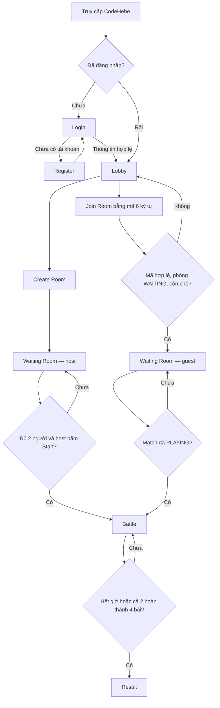

# TÀI LIỆU 1 — USER FLOW VÀ WIREFRAME V1

**Owner:** Thành viên B — Frontend và UX  
**Trạng thái:** Ready for implementation  
**Phạm vi:** Coding Battle Core V1

## 1. Mục tiêu

Tài liệu này chốt trải nghiệm người chơi cho flow V1:

```text
Register / Login
→ Lobby
→ Create Room hoặc Join Room
→ Waiting Room
→ Host Start
→ Battle
→ Result
```

Chỉ thiết kế các tính năng thuộc V1. Không bao gồm Energy, Skills, Hint, Minigames, Elo, Leaderboard, chat hoặc matchmaking tự động.

## 2. Quy ước chung

* Frontend dùng Django Templates, HTML/CSS và Vanilla JavaScript.
* Mọi trang private yêu cầu đăng nhập: Lobby, Create/Join Room, Waiting Room, Battle và Result.
* Backend là nguồn dữ liệu quyết định cho match state, timer, verdict, score và winner.
* Hidden tests không được render vào HTML, JSON response hay JavaScript của browser.
* Các trang dùng cùng base layout: logo CodeHehe, vùng thông báo Django messages và khu vực nội dung chính.

## 3. User flow



### 3.1. Nhánh lỗi và hành vi cần hiển thị

| Điểm xảy ra | Thông báo/UI mong muốn | Hành động tiếp theo |
|---|---|---|
| Register/Login không hợp lệ | Hiển thị lỗi cạnh field, giữ lại username hợp lệ | Người dùng sửa và gửi lại form |
| Join với mã không tồn tại | “Không tìm thấy phòng.” | Quay lại Lobby/nhập mã khác |
| Join phòng đầy | “Phòng đã đầy.” | Quay lại Lobby |
| Join phòng không còn chờ | “Phòng không còn ở trạng thái chờ.” | Quay lại Lobby |
| Host bấm Start khi chưa đủ người | Nút disabled hoặc thông báo “Cần đủ 2 người chơi để bắt đầu.” | Tiếp tục chờ polling |
| Submit lỗi / Judge không sẵn sàng | Verdict/error panel, không tự cộng điểm ở client | Người chơi có thể submit lại khi trận chưa hết giờ |
| Refresh khi match PLAYING | Tải lại Battle từ state server, timer không reset | Tiếp tục trận |

## 4. Wireframes

Các wireframe thể hiện cấu trúc và nội dung tối thiểu. Màu sắc, typography, animation và UI polish có thể quyết định sau; không được thay đổi các hành vi V1 đã chốt.

### 4.1. Base layout

```text
+------------------------------------------------------------------+
| CodeHehe                                      [username] [Logout]|
+------------------------------------------------------------------+
| [Django success / warning / error message, nếu có]               |
|                                                                  |
|                         PAGE CONTENT                             |
|                                                                  |
+------------------------------------------------------------------+
```

* Khi chưa đăng nhập: góc phải hiển thị `Login` và `Register`.
* Khi đã đăng nhập: hiển thị username và `Logout`.
* Thông báo server-side phải xuất hiện trước nội dung trang và có thể đóng nếu cần.

### 4.2. Login

```text
+----------------------------------+
|           Đăng nhập              |
| Username  [____________________] |
| Password  [____________________] |
|                                  |
|          [ Đăng nhập ]           |
|                                  |
| Chưa có tài khoản? [Đăng ký]     |
+----------------------------------+
```

* Hiển thị lỗi xác thực rõ ràng, không tiết lộ tài khoản nào tồn tại.
* Đăng nhập thành công chuyển tới Lobby, hoặc trang private ban đầu người dùng muốn truy cập.

### 4.3. Register

```text
+----------------------------------+
|           Đăng ký                |
| Username       [_______________] |
| Password       [_______________] |
| Confirm password[_______________] |
|                                  |
|            [ Đăng ký ]           |
|                                  |
| Đã có tài khoản? [Đăng nhập]     |
+----------------------------------+
```

* Hiển thị validation theo từng field: username trùng, password yếu hoặc password confirmation không khớp.
* Không đưa password trở lại form sau khi validation thất bại.

### 4.4. Lobby

```text
+------------------------------------------------------------------+
| Chào, <username>                                                   |
|                                                                  |
| +---------------------------+  +--------------------------------+|
| | Tạo phòng                 |  | Tham gia phòng                 ||
| | Tạo trận 1v1 mới.         |  | Mã phòng [______] [Tham gia]  ||
| | [ Tạo phòng ]             |  |                                ||
| +---------------------------+  +--------------------------------+|
|                                                                  |
| Danh sách đề                                                        |
| +--------------------------------------------------------------+ |
| | Title | Difficulty | Points |                         [Xem] | |
| +--------------------------------------------------------------+ |
+------------------------------------------------------------------+
```

* Create Room là một action rõ ràng, sau khi thành công chuyển đến Waiting Room.
* Mã phòng được chuẩn hóa chữ hoa ở client để dễ dùng, nhưng backend vẫn phải validate.
* Danh sách đề chỉ hiển thị Problem active; không hiển thị hidden test.

### 4.5. Problem detail

```text
+------------------------------------------------------------------+
| ← Quay lại danh sách đề                                           |
| <Problem title>                      [Difficulty] [Points]       |
|                                                                  |
| Đề bài                                                           |
| <statement>                                                      |
|                                                                  |
| Sample tests                                                      |
| Input:  <sample input>                                            |
| Output: <sample expected output>                                  |
|                                                                  |
| Starter code                                                      |
| +--------------------------------------------------------------+ |
| | def solve():                                                  | |
| |     pass                                                      | |
| +--------------------------------------------------------------+ |
+------------------------------------------------------------------+
```

* Đây là trang xem đề ở Tuần 1; chưa có submit hoặc verdict.
* Chỉ render title, statement, difficulty, points, starter code và sample tests.
* Không render số lượng, input, expected output hay bất kỳ metadata nào của hidden tests.

### 4.6. Waiting Room

```text
+------------------------------------------------------------------+
| Phòng: ABC123                         Trạng thái: Đang chờ       |
|                                                                  |
| Người chơi                                                       |
|  1. <host username>             Host                              |
|  2. Đang chờ người chơi thứ hai...                                |
|                                                                  |
| [ Bắt đầu trận ]  (host only; disabled khi chưa đủ 2 người)      |
|                                                                  |
| Người chơi thứ hai sẽ xuất hiện tự động.                          |
+------------------------------------------------------------------+
```

* Poll state mỗi khoảng 2 giây khi match ở `WAITING`.
* Guest không thấy hoặc không thể dùng nút Start.
* Khi state server chuyển sang `PLAYING`, cả host và guest chuyển sang Battle.

### 4.7. Battle

```text
+------------------------------------------------------------------+
| Phòng ABC123     Còn lại: 14:32       Bạn: 2 điểm | Đối thủ: 1   |
+----------------------+-------------------------------------------+
| Bài trong trận       | <MatchProblem title> [Easy] [1 point]      |
| [1] Chưa giải        |                                           |
| [2] Đã giải          | <frozen statement>                        |
| [3] Chưa giải        |                                           |
| [4] Chưa giải        | Starter code                              |
|                      | +---------------------------------------+ |
| Tiến độ đối thủ      | |                                       | |
| 1/4 bài đã giải      | +---------------------------------------+ |
|                      | [ Submit ]                                |
|                      | Verdict / loading / error panel           |
+----------------------+-------------------------------------------+
```

* Timer hiển thị theo thời gian server; frontend không tự quyết định kết thúc trận.
* Danh sách bài lấy từ `MatchProblem` đã frozen, hỗ trợ chọn bài không theo thứ tự.
* Button Submit disabled khi source code trống hoặc request đang chạy.
* Poll state mỗi khoảng 1 giây; dừng polling khi `FINISHED` và chuyển tới Result.
* First-solve indicator chỉ hiển thị khi server trả trạng thái đã finalise; không tự suy luận ở client.

### 4.8. Result

```text
+------------------------------------------------------------------+
|                         Kết quả trận                             |
|                                                                  |
|              Bạn thắng! / Hòa / Bạn thua                         |
|                                                                  |
| +----------------------+     +----------------------+            |
| | <player A>           |     | <player B>           |            |
| | Score: 6              |     | Score: 5              |            |
| | Solved: 4 / 4         |     | Solved: 3 / 4         |            |
| +----------------------+     +----------------------+            |
|                                                                  |
|                     [ Về Lobby ]                                 |
+------------------------------------------------------------------+
```

* Result chỉ truy cập được bởi MatchPlayer của trận.
* Winner/Draw và điểm lấy từ server; không dùng phép tính client-side để xác định kết quả.

## 5. Handoff cho thành viên A và C

### Thành viên A — dữ liệu và route cần có

* Context cho base layout: user hiện tại và Django messages.
* Auth routes: register, login, logout.
* Problem list/detail chỉ trả Problem active và sample tests.
* Room/Match routes trả match state, danh sách MatchPlayer và MatchProblem đã frozen.
* Quy ước route và tên context phải được chốt trước khi B tích hợp template thật.

### Thành viên C — trạng thái UI cần nhận

* Verdict chuẩn hóa: `PENDING`, `ACCEPTED`, `WRONG_ANSWER`, `COMPILATION_ERROR`, `RUNTIME_ERROR`, `TIME_LIMIT_EXCEEDED`, `INTERNAL_ERROR`.
* Payload state battle tối thiểu: match status, `ends_at`/server time, score của hai người, solved progress, first-solve đã finalize và URL Result khi Finished.
* Không có hidden tests trong bất kỳ payload frontend nào.

## 6. Definition of Done — Ngày 1, Thành viên B

Hoàn thành khi:

* User flow từ Register/Login đến Result được chốt trong tài liệu này.
* Có wireframe cho Login, Register, Lobby, Waiting Room, Battle và Result.
* Các nhánh lỗi chính và quyền host/guest đã được thể hiện.
* Wireframe không chứa tính năng ngoài V1 và không làm lộ hidden tests.
* Thành viên A và C có danh sách giao diện/dữ liệu cần phối hợp.

---

## 7. UI flow đã chốt — Ngày 2, Thành viên B

Phần này chuyển user flow thành quy ước navigation để B có thể dựng Django Templates ở Ngày 3–5 mà không phải quyết định lại hành vi màn hình.

### 7.1. Bản đồ màn hình và trạng thái

| Màn hình | Ai truy cập | Vào từ | Hành động chính | Chuyển đi |
|---|---|---|---|---|
| Login | Khách | Navbar, route private bị chặn | Đăng nhập | Lobby hoặc URL `next` hợp lệ |
| Register | Khách | Login, Navbar | Tạo tài khoản | Login hoặc tự đăng nhập theo quyết định của A |
| Lobby | Player | Login, logo, Result | Tạo phòng; nhập mã phòng; xem đề | Waiting Room hoặc Problem detail |
| Problem list/detail | Player | Lobby | Xem nội dung và sample tests | Lobby hoặc trang trước đó |
| Waiting Room | MatchPlayer | Create/Join Room; refresh | Host Start; theo dõi người chơi thứ hai | Battle khi state là `PLAYING` |
| Battle | MatchPlayer | Start; polling; refresh match `PLAYING` | Chọn bài, viết code, submit | Result khi state là `FINISHED` |
| Result | MatchPlayer | Battle hoặc refresh match `FINISHED` | Về Lobby | Lobby |

### 7.2. Quy tắc navigation

* Mỗi `POST` thành công redirect tới một `GET`; không render lại trang sau khi submit để tránh gửi lại form khi refresh.
* Người chưa đăng nhập vào route private được chuyển đến Login kèm URL quay lại hợp lệ.
* Người không thuộc Match không được xem Waiting Room, Battle hay Result của Match đó; trả về trang an toàn với Django message.
* Khi polling nhận `PLAYING` ở Waiting Room, chuyển thẳng tới Battle; khi nhận `FINISHED` ở Battle, chuyển tới Result. Không có nút client-side tự đổi trạng thái Match.
* Refresh Battle luôn tải state mới từ server. Source code chưa submit có thể mất ở V1, nên UI không hứa hẹn autosave.
* Nút logo `CodeHehe` về Lobby với Player đã đăng nhập; khách về Login.

### 7.3. Trạng thái tải và trạng thái rỗng

| Vị trí | Loading | Empty/disabled | Error |
|---|---|---|---|
| Login/Register | Nút form disabled trong lúc gửi | Không áp dụng | Lỗi form cạnh field hoặc Django message |
| Lobby | Có thể dùng skeleton ngắn cho danh sách đề | “Chưa có đề khả dụng.” | Lỗi tạo/join hiển thị message server |
| Waiting Room | Giữ danh sách player cũ khi polling | Nút Start disabled khi `< 2` player | “Không thể cập nhật phòng, đang thử lại.” |
| Battle | Giữ state cuối cùng khi polling | Submit disabled khi code trống, request đang chạy hoặc match không còn `PLAYING` | Panel hiển thị Judge/network error, cho phép submit lại nếu còn thời gian |
| Result | Không cần polling sau khi hoàn tất | Không áp dụng | Chỉ hiển thị lỗi truy cập hợp lệ từ server |

## 8. Battle layout đã chốt — Ngày 2, Thành viên B

### 8.1. Mục tiêu giao diện

Battle ưu tiên ba thông tin theo thứ tự: thời gian còn lại, tiến độ/điểm hai người chơi, và khu vực giải bài. Người chơi phải đổi bài và submit trong một màn hình, không cần chuyển route.

```text
DESKTOP (>= 960px)
+--------------------------------------------------------------------------------+
| CodeHehe | Room ABC123 | Còn lại 14:32 | Bạn 2 điểm | Đối thủ 1 điểm          |
+-----------------------+--------------------------------------------------------+
| DANH SÁCH BÀI          | BÀI ĐANG CHỌN                                         |
| [1] Easy   Chưa giải   | Tiêu đề · Easy · 1 point                             |
| [2] Easy   Đã giải     | Nội dung đề (snapshot của MatchProblem)               |
| [3] Medium Chưa giải   | Sample tests                                           |
| [4] Medium Chưa giải   |                                                        |
|-----------------------| Starter code                                           |
| ĐỐI THỦ: 1 / 4 bài    | +----------------------------------------------------+ |
| ● ● ○ ○               | | textarea / code editor                            | |
|                        | +----------------------------------------------------+ |
|                        | [Submit]  [loading hoặc verdict panel]                |
+-----------------------+--------------------------------------------------------+
```

```text
MOBILE (< 960px)
+--------------------------------------------------+
| Room ABC123 · Còn lại 14:32                     |
| Bạn 2 điểm · Đối thủ 1 điểm                      |
+--------------------------------------------------+
| [Bài 1] [Bài 2 ✓] [Bài 3] [Bài 4]               |
+--------------------------------------------------+
| Tiêu đề · Easy · 1 point                         |
| Nội dung đề / sample tests                       |
|                                                  |
| Starter code                                     |
| +----------------------------------------------+ |
| | textarea / code editor                        | |
| +----------------------------------------------+ |
| [Submit]                                        |
| Verdict panel                                   |
+--------------------------------------------------+
```

### 8.2. Vùng giao diện và trách nhiệm

| Vùng | Nội dung hiển thị | Hành vi | Dữ liệu authoritative |
|---|---|---|---|
| Match header | Room code, countdown, score hai bên | Countdown tính từ `server_now` và `ends_at`; không tự finish trận | Match state endpoint |
| Problem navigator | 4 MatchProblem, difficulty, points, trạng thái đã giải | Đổi nội dung ở panel chính, không đổi route | Match state + MatchProblem frozen |
| Opponent progress | Số bài đối thủ đã accepted; indicator từng bài không cần tên code | Cập nhật khi polling | Match state endpoint |
| Problem panel | Title, statement, difficulty, points, sample tests | Chỉ đọc snapshot MatchProblem | MatchProblem |
| Code panel | Starter code và source người chơi đang nhập | Local input; không autosave trong V1 | Starter code từ MatchProblem; draft tại browser |
| Submit/verdict panel | Submit button, loading, verdict, lỗi Judge | Một request đang chạy; client không tự cộng score | Submission response + polling state |

### 8.3. Quy ước trạng thái bài

* `Chưa giải`: chưa có Accepted của player hiện tại cho MatchProblem.
* `Đã giải`: player hiện tại đã có Accepted; vẫn có thể mở bài để xem lại, nhưng UI không khuyến khích submit lại.
* `First solve`: chỉ hiện sau khi server trả trạng thái First-solve đã finalise; không đánh dấu dựa trên thứ tự response của browser.
* UI không được hiển thị hidden test, verdict của đối thủ, source code đối thủ hoặc chi tiết submission của đối thủ.

### 8.4. Hành vi Submit

1. Player chọn một MatchProblem rồi nhập source code.
2. Khi source code chỉ có whitespace, `Submit` disabled.
3. Sau khi gửi, khóa `Submit` của request đó và hiển thị `Đang chấm...`.
4. UI nhận verdict từ server và hiển thị mapping dễ hiểu: Accepted, Wrong Answer, Compilation Error, Runtime Error, Time Limit hoặc lỗi nội bộ.
5. Score/progress sau verdict phải được xác nhận lại qua match state; client không tăng điểm cục bộ.
6. Nếu state chuyển `FINISHED`, dừng submit và polling, sau đó chuyển Result.

### 8.5. Component/template đề xuất cho Ngày 3+

| Template/partial | Mục đích |
|---|---|
| `base.html` | Header, navigation, Django messages, static assets |
| `partials/_form_errors.html` | Lỗi field/non-field cho Login, Register và Join Room |
| `partials/_match_header.html` | Room code, timer, score |
| `partials/_problem_navigator.html` | Bốn MatchProblem và trạng thái giải |
| `partials/_verdict_panel.html` | Loading, verdict và lỗi Judge |
| `battle.html` | Ghép các partial Battle, nạp JavaScript polling/submit |

Không bắt buộc tách partial ngay Ngày 3; tên trên là convention để tránh sao chép layout khi Battle được triển khai ở Tuần 3.

## 9. Definition of Done — Ngày 2, Thành viên B

Hoàn thành khi:

* Mỗi màn hình V1 có route vào, quyền truy cập, hành động chính và điều kiện chuyển trang đã chốt.
* Navigation sau form, refresh match và polling `WAITING`/`PLAYING`/`FINISHED` được quy định rõ.
* Battle layout desktop và mobile xác định rõ các vùng hiển thị, dữ liệu server-authoritative và trạng thái Submit.
* Layout không thêm feature ngoài V1, không suy luận score/winner ở client và không làm lộ hidden tests.
* Tài liệu đủ để B bắt đầu tạo `base.html`, CSS structure và template skeleton ở Ngày 3.
